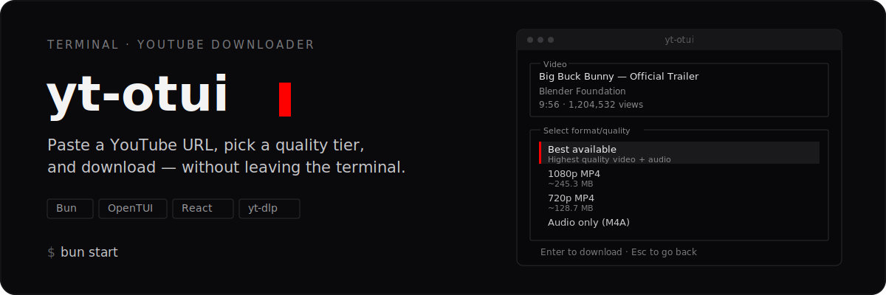
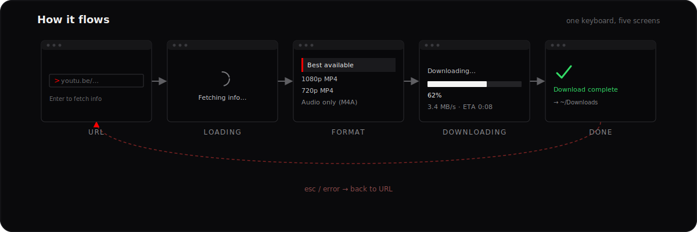

<p align="center">
  
</p>

**yt-otui** is a keyboard-driven terminal app for downloading YouTube videos. It wraps [`yt-dlp`](https://github.com/yt-dlp/yt-dlp) in a small [OpenTUI](https://opentui.com) + React interface: paste a link, pick a quality, watch real-time progress, get the file path — all in one terminal window.

<p align="center">
  
</p>

## Install & run

```bash
brew install yt-dlp   # or your package manager's equivalent — yt-otui shells out to it
bun install
bun start
```

`yt-otui` checks for `yt-dlp` on `$PATH` at startup and exits with install instructions if it's missing.

## Quality tiers

Format lists from `yt-dlp` are curated into a fixed set of options (`src/formats.ts`), skipping tiers above the source video's max resolution:

| Option | What it does |
| --- | --- |
| Best available | `bestvideo+bestaudio/best` — highest quality, any container |
| 2160p / 1440p / 1080p / 720p / 480p / 360p MP4 | Tiered `bestvideo[height<=n][ext=mp4]+bestaudio[ext=m4a]`, sized where `yt-dlp` reports it |
| Audio only (M4A) | `bestaudio[ext=m4a]` extracted to `.m4a` |

## Keyboard shortcuts

| Key | Screen | Action |
| --- | --- | --- |
| `Enter` | URL | Fetch video info |
| `Enter` | Format | Select highlighted quality and start download |
| `Esc` | URL / Done | Quit |
| `Esc` | Format | Back to URL |
| `q` | Done | Quit |
| `n` | Done | Start a new download |
| `Ctrl+Shift+/` | Any | Toggle download-directory settings |

## Configuration

Press `Ctrl+Shift+/` to open **Settings** and choose where downloads land:

- **OS Download Directory** — `~/Downloads` (default)
- **Current Directory** — wherever `yt-otui` was launched from
- **Input Directory** — a custom path you type in

The choice persists to `~/.config/yt-otui/config.json`; delete that file to reset to defaults.

## Under the hood

- Every `yt-dlp` call runs via `Bun.spawn` (`src/ytdlp.ts`) — `-J` for metadata, a `--progress-template` piped line-by-line for live speed/ETA during download.
- The UI is a screen state machine (`src/App.tsx`): URL → Loading → Format → Downloading → Done for single videos, with a parallel Playlist Choice → Playlist Format → Playlist Downloading → Playlist Done path for playlist URLs, and error/Esc paths back to URL.
- Rendered entirely with OpenTUI's React bindings — no browser, no Electron.

See [`openwiki/architecture/overview.md`](./openwiki/architecture/overview.md) for the full component and data-flow breakdown.

## Limitations

- No automated test suite yet; see `openwiki/quickstart.md` for the manual verification steps used today.

## Development

```bash
bun run typecheck   # tsc --noEmit
bun run build       # bundle to ./dist
bun run compile     # standalone binary via `bun build --compile`
bun run preview     # run the built bundle
```
